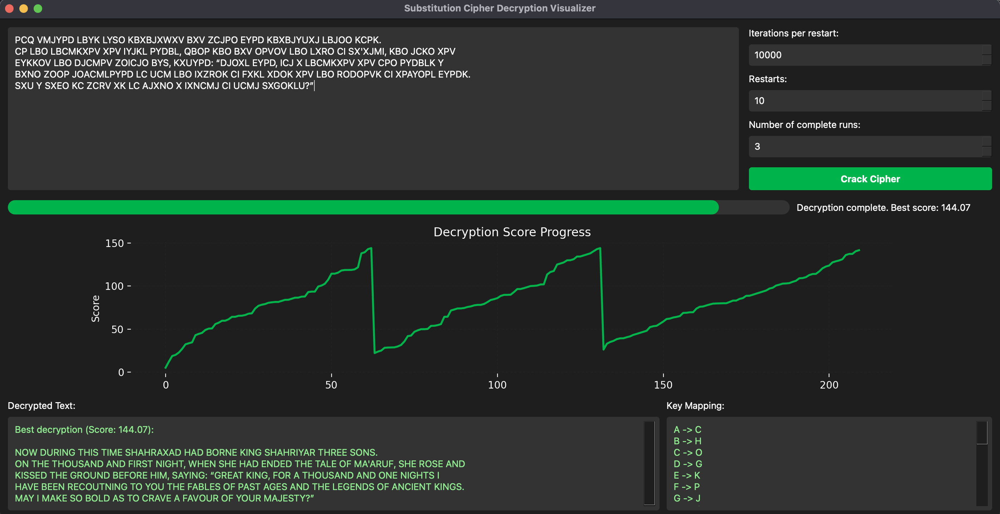

# Substitution Cipher Decryption Visualizer

## Introduction
This program uses a **hill-climbing algorithm** to crack monoalphabetic substitution ciphers. It visualizes the decryption process in real-time, showing how the algorithm progresses toward a potential solution. Substitution ciphers, which replace letters in plaintext with corresponding ciphertext letters, have been used for centuries. Julius Caesar famously used a simple substitution cipher, known as the Caesar cipher, to encrypt his military messages.

### Quick Start

1. Create and activate a virtual environment:
   ```bash
   python -m venv venv
   source venv/bin/activate  # On Windows, use `venv\Scripts\activate`
   ```

2. Install the necessary dependencies:
   ```bash
   pip install -r requirements.txt
   ```

3. Run the application:
   ```bash
   python main.py
   ```

## Substitution Ciphers
A substitution cipher replaces plaintext letters with ciphertext according to a fixed mapping. The goal is to discover this mapping, transforming ciphertext back into readable plaintext.

## Example 1
### Description
This example demonstrates the decryption of a classic monoalphabetic substitution cipher where letters are replaced according to a fixed cipher alphabet.

### Input Ciphertext:
```
PCQ VMJYPD LBYK LYSO KBXBJXWXV BXV ZCJPO EYPD KBXBJYUXJ LBJOO KCPK.
CP LBO LBCMKXPV XPV IYJKL PYDBL, QBOP KBO BXV OPVOV LBO LXRO CI SX'XJMI, KBO JCKO XPV
EYKKOV LBO DJCMPV ZOICJO BYS, KXUYPD: “DJOXL EYPD, ICJ X LBCMKXPV XPV CPO PYDBLK Y
BXNO ZOOP JOACMLPYPD LC UCM LBO IXZROK CI FXKL XDOK XPV LBO RODOPVK CI XPAYOPL EYPDK.
SXU Y SXEO KC ZCRV XK LC AJXNO X IXNCMJ CI UCMJ SXGOKLU?”
```

### Program Output:
```
NOW DURING THIS TICE SHAHRAQAD HAD BORNE KING SHAHRIYAR THREE SONS. 
ON THE THOUSAND AND FIRST NIGHT, WHEN SHE HAD ENDED THE TALE OF CA'ARUF, SHE ROSE AND 
KISSED THE GROUND BEFORE HIC, SAYING: “GREAT KING, FOR A THOUSAND AND ONE NIGHTS I 
HAVE BEEN REJOUTNING TO YOU THE FABLES OF PAST AGES AND THE LEGENDS OF ANJIENT KINGS. 
CAY I CAKE SO BOLD AS TO JRAVE A FAVOUR OF YOUR CAZESTY?”
```

### Real Message:
```
NOW DURING THIS TIME SHAHRAZAD HAD BORNE KING SHAHRIYAR THREE SONS.
ON THE THOUSAND AND FIRST NIGHT, WHEN SHE HAD ENDED THE TALE OF MA'ARUF, SHE ROSE AND
KISSED THE GROUND BEFORE HIM, SAYING: "GREAT KING, FOR A THOUSAND AND ONE NIGHTS I
HAVE BEEN RECOUNTING TO YOU THE FABLES OF PAST AGES AND THE LEGENDS OF ANCIENT KINGS.
MAY I MAKE SO BOLD AS TO CRAVE A FAVOUR OF YOUR MAJESTY?"
```

## Example 2
### Description
This example demonstrates the decryption of a Caesar cipher with a shift of 3, where each letter in the plaintext is shifted by three positions in the alphabet.

### Input Ciphertext:
```
WKH TXLFN EURZQ IRA, WKH FDW LV LQ WKH JDUGHQ. WKH FKLOGUHQ DUH SODBLQJ QHDU WKH ODNH.
WKHLU GDXJKWHU LV UHDGLQJ D ERRN EB WKH WUHH. WKHBR ZLOO VRRQ EH MRLQHG EB WKHLU IULHQGV IRU D SLFQLF XQGHU WKH VXQ. HYHUBRQH LV HAFLWHG WR VSHQG WLPH WRJHWKHU RXWGRRUV.
```

### Program Output:
```
THE QUICK WROFN BOX JUMPS OVER THE LAZY DOG IN THE GARDEN. THE CHILDREN ARE PLAYING NEAR THE LAKE. THEIR DAUGHTER IS READING A WOOK WY THE TREE. THEYO FILL SOON WE JOINED WY THEIR BRIENDS BOR A PICNIC UNDER THE SUN. EVERYONE IS EXCITED TO SPEND TIME TOGETHER OUTDOORS.
```

### Real Message:
```
THE QUICK BROWN FOX JUMPS OVER THE LAZY DOG IN THE GARDEN. THE CHILDREN ARE PLAYING NEAR THE LAKE. THEIR DAUGHTER IS READING A BOOK BY THE TREE. THEY WILL SOON BE JOINED BY THEIR FRIENDS FOR A PICNIC UNDER THE SUN. EVERYONE IS EXCITED TO SPEND TIME TOGETHER OUTDOORS.
```

### Note on Partial Decryption
In some cases, the program might not fully crack the key mappings but still generate enough accurate characters for you to understand the essence of the message. Codebreakers sometimes don't need to completely break the key to decipher the intent behind a message.

### Note on Short Input Lengths
The shorter the input ciphertext, the more challenging it becomes for the program to crack the cipher correctly. This is because the algorithm relies on matching keys that produce valid English dictionary words. Larger ciphertexts provide more data for the algorithm to make accurate matches.

## How It Works

### Hill Climbing Algorithm
The algorithm solves the cipher by repeatedly trying to improve a candidate solution (key mapping). Here's how it works:
1. **Initial Guess**: The algorithm starts with a random mapping of ciphertext to plaintext letters.
2. **Score Calculation**: It calculates the score of this mapping based on **bigram frequencies** (two-letter combinations), the percentage of **valid English words**, and the **dictionary reinforcement** step, which checks how many words match the English dictionary using NLTK.
3. **Key Modification**: Two letters in the key are swapped.
4. **Score Comparison**: If the modified key improves the score, the algorithm keeps it; otherwise, it discards the change.
5. **Restarting**: After many iterations, the algorithm restarts from a new random key to avoid getting stuck in bad solutions. It runs multiple restarts and selects the best result.

### Practical Approach
The algorithm narrows the search space by using bigram frequencies (common letter pairs like 'TH' and 'HE') and valid English word matching. The **dictionary check** step reinforces the process by ensuring that the decrypted text makes sense in English. This makes the algorithm fast and effective, particularly for English ciphertexts, as it leverages the NLTK English corpus.

### Efficiency
Even though there are around \(4 \times 10^{26}\) possible keys for a substitution cipher, the algorithm avoids checking all combinations. Instead, it focuses on a small subset of keys that produce plausible English text, using heuristic methods like bigram frequency analysis, valid word matching, and dictionary checks to drastically reduce the keyspace.

## Modern Cipher Comparison
This program is designed for **simple monoalphabetic substitution ciphers**. Modern ciphers like **AES-256** are far more secure. While substitution ciphers have around \(4 \times 10^{26}\) possible keys, AES-256 has \(2^{256}\) possible keys (approximately \(1.16 \times 10^{77}\)). Additionally, AES uses multiple rounds of substitutions, permutations, and other complex operations, making it resistant to frequency analysis and hill climbing.

In summary:
- **Monoalphabetic Substitution Cipher**: ~\(4 \times 10^{26}\) possible keys.
- **AES-256**: ~\(1.16 \times 10^{77}\) possible keys.

This highlights why the techniques used in this program are effective for classical ciphers but unsuitable for modern encryption standards.

## Usage
1. Enter the ciphertext you want to crack.
2. Adjust the number of iterations, restarts, and runs to control how long the algorithm runs.
3. Click "Crack Cipher" to start the decryption.
4. Watch the decryption progress in real time, with both the decrypted text and score graph updating.

## Visual Example
Below is an example of the tool in action, showing the decryption process:



## Summary
This tool uses hill climbing, bigram frequency analysis, and dictionary-based word matching to crack monoalphabetic substitution ciphers. It's a flexible and dynamic approach to solving substitution ciphers, combining cryptographic techniques with real-time visualization for educational or analytical purposes.
